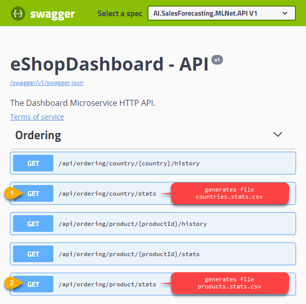
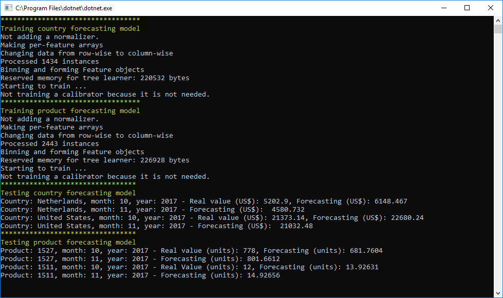

# Create and Train the models [optional]

The dashboard app comes with a previously trained models, but you can train your own model based in your own data. 

The console application project `eShopForecastModelsTrainer` can be used to generate the country and product forecasting models. You need to follow next steps in order to generate these models:

1) **Configure NuGet in VS:** Temporarily (until the ML.NET NuGet package is published in a public NuGet feed), you need to set up a local nuget repository in your machine, targeting the `eShopForecastModelsTrainer/nuget` folder (check [Setting up eShopDashboard in Visual Studio](./Setting-up-eShopDashboard-in-Visual-Studio-and-running-it.md)) for loading ML.Net dependencies

2) **Set VS default startup project:** Set `eShopForecastModelsTrainer` as starting project in Visual Studio

3) **(Optional) - Generate your own input training data:** The `eShopForecastModelsTrainer/data` folder contains default training input .csv files. 
If you want to use your own input data to train the models (your own .csv files), you can use the data stored in the databases and generate the .csv training files using the Ordering controller API via Swagger UI. While running the application, open the Swagger endpoint in a browser (in local development, it should be hosted at a similar URL to this http://localhost:58991/swagger/ although the port might be different in your case so you might need to change it to the port used by your app's execution), and then run `api/ordering/country/stats` and `api/ordering/product/stats`, as you can see in the following screenshot:

Then copy/move those files generated from Swagger UI into the `eShopForecastModelsTrainer/data` folder, using exactly the same file names than the original/default ones.

4) **Run the training model console app:** Hit F5 in Visual Studio. At the end of the execution, the output will be similar to this screenshot:

5) **Copy the model files into the Dashboard app folder:** When the execution finishes, you can find the built models in the bin folder. These files are named `country_month_fastTreeTweedle.zip` and `product_month_fastTreeTweedle.zip`

The model files should be copied/pasted into the dashboard folder Models (`eShopDashboard/Forecast/Models`) using the same names.
